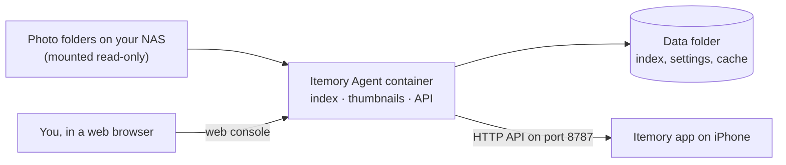

# Itemory Agent

**English** | [简体中文](README.zh-CN.md)

Itemory Agent is an optional companion service for the **Itemory** photo app on iPhone. You run it on your own NAS (or any computer with Docker). It indexes the photos and videos in the folders you choose, prepares thumbnails ahead of time, and serves them to the app over your home network.

Your photos never leave your NAS: the agent only reads them, and there is no cloud account involved.

## Do I need it?

The Itemory app can already read a NAS directly through a shared folder (SMB or WebDAV). The agent is worth installing when that feels slow.

| | Shared folder (SMB / WebDAV) | Itemory Agent |
| --- | --- | --- |
| Setup | Nothing to install on the NAS | Run one Docker container |
| Browsing speed | The app has to fetch and scan files itself | Index and thumbnails are prepared on the NAS in advance |
| Capture date, location, Live Photos, RAW previews | Read by the app file by file | Read once on the NAS and cached |
| Good for | Small libraries, quick try-out | Large libraries, many videos, slower Wi-Fi |

## What you need

- A NAS or computer that can run **Docker containers with Docker Compose**. This covers Synology (Container Manager), QNAP (Container Station), TrueNAS SCALE, Unraid, fnOS, OpenMediaVault and most Linux machines. Both `amd64` (Intel/AMD) and `arm64` (ARM) are supported.
- The folder where your photos and videos are stored on that NAS.
- An iPhone with the Itemory app. NAS data sources are part of Itemory Pro and are included in the free trial.
- The iPhone and the NAS on the same network (usually the same Wi-Fi).

## Quick start

1. **Create the container** from the ready-made template for your NAS in [`deploy/compose/`](deploy/compose), after changing the photo folder path.
2. **Open the web console** at `http://<your-NAS-IP>:8787` and create an administrator account.
3. **Pair your iPhone**: in the console open *Pairing & devices* → *Start pairing*, then in the app go to *Data Sources* → *Enhanced service* → *Scan QR code*.
4. **Choose folders**: in the app open *Enhanced Service Settings* → *Libraries* → *Add Folder*, then save. The first scan starts right away.

Never used Docker on your NAS before? Follow the [installation guide](docs/installation.md). It walks through every step, including how to find your folder paths.

Using an AI agent that can run commands on your NAS? Give it the ready-made prompt in [Deploy with an AI agent](docs/deploy-with-ai-agent.md) and let it do the setup.

## Documentation

| Guide | What it covers |
| --- | --- |
| [Installation](docs/installation.md) | Step-by-step setup for each NAS, pairing, choosing folders |
| [Deploy with an AI agent](docs/deploy-with-ai-agent.md) | A prompt to copy into your AI agent so it installs the agent for you |
| [Configuration](docs/configuration.md) | Template options, memory and CPU limits, performance presets, HTTPS |
| [Upgrading and backup](docs/upgrading.md) | Updating, backing up, rolling back, uninstalling |
| [Troubleshooting](docs/troubleshooting.md) | Common problems and how to fix them |
| [Security policy](SECURITY.md) | How access works, how to report a vulnerability |
| [Contributing](CONTRIBUTING.md) | Building from source, running tests, releasing |

## How it works

- The agent scans the folders you picked, reads capture time, GPS, video length, Live Photo pairs and RAW previews, and stores the results in a small SQLite database in its data folder.
- It rescans every night (03:00 by default) and only re-reads files that changed.
- The iPhone gets its own access token when you scan the pairing QR code. The administrator password is only used in the web console and is never shared with the app.

## License

[MIT](LICENSE)
