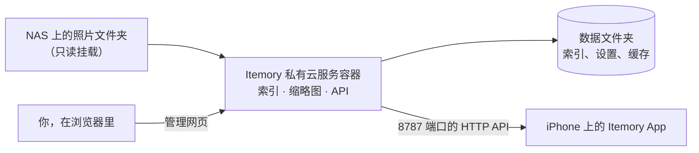

# Itemory 私有云服务

[English](README.md) | **简体中文**

Itemory 私有云服务是 iPhone 相册应用 **Itemory** 的可选自建服务。它运行在你自己的私有云设备、NAS 或任何装有 Docker 的电脑上，为选定文件夹里的照片和视频建立索引、提前生成缩略图，再通过家里的局域网提供给 App。

照片不会离开你的 NAS：服务只读取文件，不需要任何云端账号。

> [!TIP]
> **让 AI Agent 替你部署。** 如果你在用能在 NAS 上执行命令的 AI Agent（例如通过 SSH），复制我们准备好的提示词，填几项信息后发给它。Agent 会检查 NAS 环境、写好 compose 文件、启动容器并验证结果；全程不会改动你的照片，也不会向你索要密码。
>
> **[→ 获取 AI 部署提示词](docs/deploy-with-ai-agent.zh-CN.md)**

## 我需要它吗？

Itemory App 本身就能通过共享文件夹（SMB 或 WebDAV）直接读取私有云设备。如果觉得这种方式慢，再安装 Itemory 私有云服务。

| | 共享文件夹（SMB / WebDAV） | Itemory 私有云服务 |
| --- | --- | --- |
| 部署 | NAS 上不用安装任何东西 | 运行一个 Docker 容器 |
| 浏览速度 | App 自己逐个读取、扫描文件 | 索引和缩略图已在 NAS 上提前准备好 |
| 拍摄时间、位置、实况照片、RAW 预览 | App 逐个文件读取 | NAS 上读取一次后缓存 |
| 适合 | 照片不多、先试试看 | 照片多、视频多、Wi-Fi 较慢 |

## 需要准备什么

- 一台能运行 **Docker 容器和 Docker Compose** 的 NAS 或电脑，包括群晖（Container Manager）、威联通（Container Station）、TrueNAS SCALE、Unraid、飞牛 fnOS、OpenMediaVault 以及大多数 Linux 机器。支持 `amd64`（Intel/AMD）和 `arm64`（ARM）两种架构。
- 知道照片和视频存放在 NAS 上的哪个文件夹。
- 装有 Itemory App 的 iPhone。私有云数据源属于 Itemory Pro 权益，免费体验期内可以使用。
- iPhone 和 NAS 在同一个网络里（通常是同一个 Wi-Fi）。

## 快速开始

1. **创建容器**：从 [`deploy/compose/`](deploy/compose) 里选你的 NAS 对应的模板，把照片文件夹路径改成你自己的，然后部署。
2. **打开管理网页**：浏览器访问 `http://<NAS 的 IP>:8787`，创建管理员账号。
3. **配对 iPhone**：在管理网页打开「配对与设备」→「开始配对」，然后在 App 中进入「数据源」→「Itemory 私有云服务」→「扫描二维码」。
4. **选择文件夹**：在 App 中打开「Itemory 私有云设置」→「媒体库」→「添加文件夹」，保存后立即开始第一次扫描。

第一次在 NAS 上用 Docker？请按[安装指南](docs/installation.zh-CN.md)操作，里面有每一步的说明，包括怎么找到文件夹路径。

想把安装交给 AI Agent？见[让 AI Agent 帮你部署](docs/deploy-with-ai-agent.zh-CN.md)。

## 文档

| 文档 | 内容 |
| --- | --- |
| [安装指南](docs/installation.zh-CN.md) | 各 NAS 的分步安装、配对、选择文件夹 |
| [让 AI Agent 帮你部署](docs/deploy-with-ai-agent.zh-CN.md) | 复制给 AI Agent 的提示词，让它替你完成安装 |
| [配置说明](docs/configuration.zh-CN.md) | 模板参数、内存与 CPU 上限、性能档位、HTTPS |
| [升级与备份](docs/upgrading.zh-CN.md) | 升级、备份、回滚、卸载 |
| [常见问题](docs/troubleshooting.zh-CN.md) | 常见问题及解决办法 |
| [安全策略](SECURITY.zh-CN.md) | 访问权限如何划分、如何报告漏洞 |
| [参与开发](CONTRIBUTING.zh-CN.md) | 从源码构建、运行测试、发布 |

## 工作原理

- 服务扫描你选定的文件夹，读取拍摄时间、GPS、视频时长、实况照片配对和 RAW 内嵌预览，结果保存在数据文件夹里的一个小型 SQLite 数据库中。
- 每天夜里（默认 03:00）自动重新扫描，只重新读取有变化的文件。
- iPhone 扫描配对二维码后获得自己的访问令牌。管理员密码只在管理网页中使用，不会交给 App。

## 许可证

[MIT](LICENSE)
